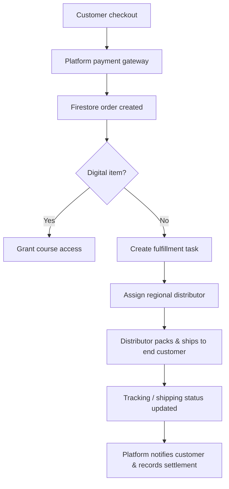

# 經銷商履約與平台收款整合規劃
**Version**: 2026.05.31.V1  
**Objective**: Define a platform-led payment model where Vibe Coding centrally collects payments, while local distributors handle physical product fulfillment and customer delivery.

## 1. Core Positioning

Vibe Coding 的物流模式不再以「平台自己直出給終端客戶」為唯一思路，而是改成：

- **Payment by Platform**: 使用者一律向 Vibe Coding 平台付款。
- **Fulfillment by Distributors**: 台灣與海外的實體商品，統一由當地經銷商 / 履約夥伴出貨給終端客戶。
- **Platform as Control Tower**: 平台負責訂單、授權、分潤、通知、稽核與履約派單。

這代表平台不是倉儲公司，而是：

1. 交易中樞
2. 履約派單中樞
3. 分潤與結帳中樞
4. 退款與異常處理中樞

## 2. Target Operating Model

## 3. Role Split

### 3.1 Platform responsibilities
- 收款與付款回寫
- 訂單建立與授權
- 將實體商品訂單派給正確的經銷商 / 履約夥伴
- 管理訂單狀態、通知與稽核
- 處理退款、折讓、取消、異常客服
- 結算分潤與對帳

### 3.2 Distributor responsibilities
- 接單
- 備貨 / 包裝 / 寄送
- 更新物流號碼與履約狀態
- 處理在地售後與區域運送成本
- 回報缺貨、延遲或異常

### 3.3 Customer responsibilities
- 在平台完成付款
- 透過平台 Dashboard 追蹤出貨 / 履約狀態
- 若為課程 + 硬體組合，先完成授權，再等待實體商品履約

## 4. Geographic Strategy

- **台灣**：預設也採經銷商出貨，不由平台直送終端客戶。
- **海外**：同樣採當地經銷商 / 合作履約夥伴出貨，以降低跨境運輸、關稅與退貨成本。
- **例外情境**：若某區域尚未建立履約夥伴，訂單須停留在待分派狀態並觸發 Admin 告警，不得假設平台直接出貨給終端客戶。

## 5. Recommended Firestore Data Model

### `orders` collection additions
| 欄位 | 類型 | 說明 |
| :--- | :--- | :--- |
| `fulfillmentType` | string | 履約模式，建議固定為 `distributor`。 |
| `fulfillmentPartnerId` | string | 履約經銷商 / 合作夥伴識別碼。 |
| `fulfillmentPartnerName` | string | 履約夥伴名稱。 |
| `fulfillmentRegion` | string | 履約地區，例如 `TW`, `SG`, `US-West`。 |
| `fulfillmentStatus` | string | 履約狀態，例如 `PENDING`, `ASSIGNED`, `ACCEPTED`, `SHIPPED`, `DELIVERED`. |
| `fulfillmentAssignedAt` | timestamp | 平台派單時間。 |
| `fulfillmentAcceptedAt` | timestamp | 經銷商接單時間。 |
| `fulfillmentShippedAt` | timestamp | 經銷商出貨時間。 |
| `trackingNumber` | string | 追蹤號碼或物流單號。 |
| `carrier` | string | 承運商或配送方式。 |
| `shippingCost` | number | 實際履約成本。 |
| `handlingFee` | number | 經銷商處理費 / 履約費。 |
| `fulfillmentNotes` | array | 異常、缺貨、改派等備註。 |

### `fulfillment_partners` collection（建議新增）
| 欄位 | 類型 | 說明 |
| :--- | :--- | :--- |
| `partnerId` | string | 經銷商識別碼。 |
| `displayName` | string | 顯示名稱。 |
| `regions` | array | 可履約區域。 |
| `allowedProducts` | array | 可出貨商品範圍。 |
| `settlementRate` | number | 履約結算比例或服務費率。 |
| `slaDays` | number | 標準出貨 SLA。 |
| `active` | boolean | 是否啟用。 |

## 6. Order Flow

1. 使用者於平台完成付款。
2. 平台完成課程授權或數位權益開通。
3. 若訂單包含實體商品，平台建立 `fulfillmentTask` 並指派給對應履約夥伴。
4. 經銷商在後台接單並更新出貨資訊。
5. 平台同步更新訂單履約狀態與物流資訊。
6. 平台寄送出貨 / 履約通知給客戶。
7. 每月依分潤政策與履約費用進行結算。

## 7. Settlement Principles

- **收款集中**：所有終端收款仍由平台完成。
- **履約結算分離**：經銷商依實際履約狀況、區域與商品類型結算。
- **保留風險控管**：退款、取消、缺貨、延遲要先由平台控管，再與經銷商對帳。
- **分潤可參數化**：導師分潤、經銷商分潤、新課程開發分潤可獨立調整。

## 8. Operational Notes

1. 平台不應再把「物流」等同於「平台直送終端客戶」。
2. Dashboard 的物流 / 履約管理應視為「履約管理」。
3. 台灣與海外應統一走同一套派單與結算模型，只是 partner 與配送方式不同。
4. 若日後加入更多國家，只需新增該地區的履約夥伴與費率規則，不必改變收款核心。

## 9. Current Implementation Status

- **已完成**
  - 平台收款、訂單建立、付款回寫
  - `orders.logistics` 資料結構已支援多地區收件資訊
  - 出貨 / 履約通知、Dashboard 管理頁、物流管理頁已存在
- **尚待完成**
  - `fulfillment_partners` 的正式資料模型與派單 UI
  - 經銷商接單後台
  - 多國履約結算報表
  - 平台 / 經銷商 / 客戶三方的退款與缺貨責任協議

更多操作層規格請見：
- [經銷商履約管理機制規劃](./distributor-fulfillment-operations.md)
- [經銷商/導師/價格工程規格](./distributor-tutor-pricing-engineering-spec.md)
