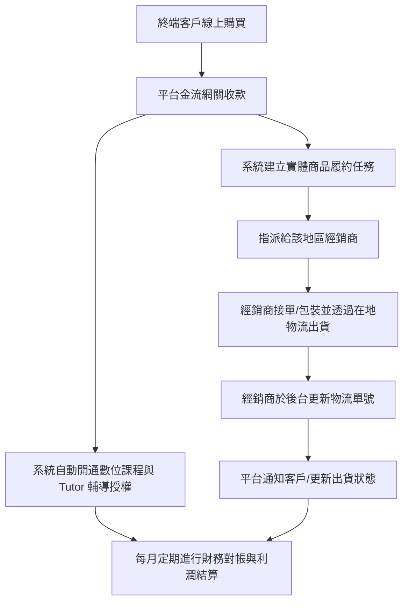

# Vibe Coding 區域經銷商全球招募與合作規範說明書
**版本**: 2026.06.07.V1  
**核心宗旨**: 攜手優秀的在地合作夥伴，推動 Physical AI 教育全球落地，共創 AI 教育藍海市場。

---

## 1. 合作背景與市場機會

Vibe Coding 致力於提供創新且具體可見的 **Physical AI (實體人工智慧)** 程式教育。我們彌合了抽象代碼與真實硬體（如 BLE 智慧自走車、物聯網控制器、機械手臂等）之間的鴻溝。
隨著全球對 AI 教育與動手實作（Project-Based Learning）需求的爆發，我們建立了**「軟硬整合、AI 輔助開發」**的核心教育體系，並將實體套件銷售與雲端數位課程完美結合。

為了加速全球市場覆蓋，我們誠邀具備在地物流、行銷及售後服務能力的「區域經銷商（Regional Distributors）」加入，共同經營各國家/地區的 Physical AI 教育市場。

---

## 2. 合作模式：平台收單，在地履約 (Platform-led, Local Fulfillment)

Vibe Coding 採用領先的**「平台集中收款、經銷商在地履約」**合作模式：

1. **平台集中收款 (Payment by Platform)**: 終端客戶（學生、家長、學校、機構）一律透過 Vibe Coding 官方平台進行下單與付款。
2. **數位課程即時授權 (Instant Digital Access)**: 客戶完成付款後，系統立即自動開通其購買的數位課程、Tutor 輔導授權與學習路徑授權。
3. **經銷商在地履約 (Fulfillment by Distributors)**: 訂單中包含的實體硬體套件，將透過平台自動派單機制（Fulfillment Task），交由該收件區域的合作經銷商負責揀貨、包裝、在地物流配送及在地售後服務。
4. **控制塔管理模式 (Platform as Control Tower)**: 平台負責運作核心系統、金流網關、區域路由派單、分潤結算與全球行銷推廣。

---

## 3. 經銷商的核心權益與平台承諾 (Rights & Vibe Coding Commitments)

合作經銷商在授權區域內享有以下權利與支持：

### 3.1 區域獨家/優先履約權
* **專屬區域保護**: 在約定地區（如：台灣、新加坡、美國西部等）內，享有平台實體硬體訂單的獨家或優先派單履約權。
* **跨境物流成本降低**: 避免傳統跨境寄送的昂貴運費、複雜關稅與退換貨成本，最大化在地化利潤。

### 3.2 地區定價自主權 (Distributor Price Books)
* **定價靈活度**: 經銷商可透過專屬「經銷商控制台（Distributor Console）」，針對特定區域商品與課程套餐設定自主定價（例如配合當地消費水準調整 TWD / SGD / USD 售價）。
* **活動促銷碼管理**: 經銷商可為當地合作導師、學校機構建立專屬優惠代碼，並綁定經銷利潤結算。

### 3.3 穩定且多管道的利潤來源 (Revenue Streams)
* **硬體耗材毛利**: 獲得實體硬體套件及耗材的原廠批發優惠價與出貨結算。
* **平台履約服務費 (Handling Fee)**: 每筆指派並完成的履約訂單，皆可獲得約定的履約服務費/物流處理費。
* **課程與 Tutor 輔導訂閱分潤 (Software Share)**: 對於由經銷商直接開發的在地客戶、學校或搭配硬體售出的數位課程，享有高比例的軟體分潤（Settlement Rate）。

### 3.4 品牌行銷與數位內容支持
* **教材與課程資源**: 平台提供持續更新的繁體中文、英文等多語系高品質課程、講義及 AI 生成模板。
* **品牌聯合推廣**: 經銷商可列名於官方合作夥伴清單，享有平台主導的全球/地區行銷活動曝光。

---

## 4. 經銷商的義務與運營規範 (Distributor Obligations & Operations SLA)

為維護終端客戶的學習體驗及 Vibe Coding 品牌聲譽，合作經銷商必須履行以下義務：

### 4.1 履約時效與承諾 (Fulfillment SLA)
* **出貨時效 (SLA Days)**: 收到平台分派的實體訂單任務後，經銷商須於約定工作日（通常為 2-3 個工作日）內完成揀貨、打包並交付在地物流。
* **物流追蹤資訊回寫**: 出貨時必須將真實的物流承運商（如黑貓宅急便、順豐速運等）與追蹤號碼（Tracking Number）輸入或透過 API 回傳至平台，以供終端客戶即時查詢。

### 4.2 庫存管理與安全儲備 (Inventory Management)
* **基本庫存保證**: 經銷商須承諾在當地維持一定數量的安全庫存，避免因缺貨導致客戶學習中斷。
* **異常即時通報**: 若遇缺貨、物流受阻或延遲，必須立即於系統回報「異常狀態（EXCEPTION）」，以便平台客服進行客戶安撫或協調。

### 4.3 在地售後服務與保固 (Local Support & Warranty)
* **硬體售後維修**: 負責處理該區域實體硬體商品的瑕疵換貨、保固維修與技術支援。
* **七天鑑賞期與退換貨**: 配合當地法規處理退換貨之實體商品點收、整新與倉儲。

### 4.4 品牌合規與市場拓展
* **形象維護**: 銷售與宣傳必須符合 Vibe Coding 官方品牌規範，不得私自竄改教材核心內容或用於非授權用途。
* **市場推廣**: 主動維護並開發當地的學校、安親班、自學團體及創客教育機構，推廣 Physical AI 教育方案。

---

## 5. 權利義務對照表

| 項目 | 平台的權利與義務 (Platform) | 經銷商的權利與義務 (Distributor) |
| :--- | :--- | :--- |
| **金流收款** | **義務**: 提供安全可靠的線上金流，統一向客戶收款。 **權利**: 掌控訂單最終控制權與退款權限。 | **權利**: 無須自行開發維護金流與線上收款系統。 **義務**: 接受平台統一收款與結算規則。 |
| **數位課程與授權** | **義務**: 提供雲端課程平台維護、Tutor 輔導授權與學習路徑更新。 | **權利**: 獲得授權推廣平台數位課程，並享有銷售分潤。 |
| **硬體履約出貨** | **權利**: 將實體訂單派單給對應區域經銷商，並稽核其時效。 **義務**: 即時將客戶收件資料加密傳輸給經銷商。 | **權利**: 獲得專屬區域的硬體配送權。 **義務**: 負責備貨、揀打包裝，並於 2-3 日內出貨回寫追蹤碼。 |
| **售後與退換貨** | **義務**: 客服第一線對接客戶退款申請，把關退貨標準。 | **義務**: 提供在地實體退換貨倉儲、硬體瑕疵更換及硬體維修保固。 |
| **對帳結算** | **義務**: 按約定結算週期（如月結）提供清晰透明的對帳單，並撥付款項。 | **權利**: 按期收取硬體出貨費、軟體分潤及履約服務費。 |

---

## 6. 財務結算與對帳細則 (Settlement & Reconcile Rules)

### 6.1 結算週期
平台與經銷商採取 **月結 (Monthly Settlement, T+30)** 機制：
* **對帳日**: 每月 5 號前，平台自動生成上一個日曆月的履約結算報表（包含已完成的 `fulfillment_tasks` 與相關訂單金額）。
* **確認日**: 雙方於每月 10 號前完成報表確認。
* **付款日**: 平台於每月 25 號前將應付款項匯入經銷商指定銀行帳戶。

### 6.2 結算公式與項目
經銷商每月的結算總額為以下項目之總和：
1. **硬體結算價 (Hardware COGS Settlement)**: 每個實體商品套件的約定採購底價。
2. **履約服務費 (Handling Fee)**: 平台補貼經銷商的包材與處理費（如每筆訂單 $XX 元）。
3. **推廣軟體分潤 (Software Commission)**: 由該經銷商推廣渠道產生的數位課程銷售，依銷售額的 `Settlement Rate` % 進行分潤。
4. **扣除項**: 發生退貨退款之訂單（如符合退貨規定，且非因經銷商出貨失誤導致），將於當期結算款中扣除對應的軟體分潤，但若已產生實際在地運費，運費損失分擔由個別合作合約另行約定。

---

## 7. 加入與審查流程 (Onboarding Flow)

1. **提交申請**: 填寫合作意向書，提供公司營業執照、在地倉儲照片、預估首批進貨量及當地推廣計畫。
2. **資質審查**: 平台評估經銷商的在地物流配送能力（如倉庫 SLA）、售後保固維修能力及市場渠道資源。
3. **簽署合約**: 雙方確認授權區域、首批進貨量、各商品的經銷價格（Price Book）與軟體分潤費率。
4. **帳號開通與系統對接**: 平台為經銷商建立專屬 `partnerId`，開通經銷商控制台帳號，綁定物流追蹤回寫系統。
5. **首批硬體交貨**: 經銷商完成首批硬體進貨，庫存入庫後，平台正式將該區域實體商品的購買頁面激活，並開始自動派單。
