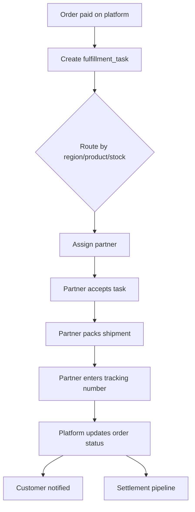

# 經銷商履約管理機制規劃
**Version**: 2026.05.31.V1  
**Objective**: Define the operational workflow and dashboard mechanism for distributor-managed fulfillment while the platform keeps payment, order control, and settlement centrally.

## 1. Why this document exists

`docs/distributor-fulfillment-model.md` 定義的是「平台收款、經銷商履約」的總體營運模式。  
本文件則補足「**平台要怎麼幫經銷商做履約管理**」的操作層規格，避免履約責任分散後失去可控性。

## 2. Design Principles

1. 平台仍是唯一收款與訂單控制中心。
2. 經銷商不是自由出貨，而是透過平台分派任務。
3. 每筆實體商品訂單都應對應一筆 `fulfillment_task`。
4. 履約狀態必須可追蹤、可稽核、可結算。
5. 異常（缺貨、延遲、改寄、退貨）必須回寫 Firestore。

## 3. Workflow Overview

## 4. Core Collections

### 4.1 `fulfillment_tasks`
One document per physical-order fulfillment action.

Suggested fields:
| 欄位 | 類型 | 說明 |
| :--- | :--- | :--- |
| `taskId` | string | 任務識別碼。 |
| `orderId` | string | 關聯訂單。 |
| `uid` | string | 購買者 UID。 |
| `partnerId` | string | 指派經銷商 / 履約夥伴。 |
| `partnerName` | string | 經銷商名稱。 |
| `region` | string | 地區。 |
| `status` | string | `PENDING`, `ASSIGNED`, `ACCEPTED`, `PACKING`, `SHIPPED`, `DELIVERED`, `EXCEPTION`, `CANCELLED`。 |
| `trackingNumber` | string | 物流追蹤號碼。 |
| `carrier` | string | 承運商 / 配送方式。 |
| `shippingAddress` | map | 收件資訊。 |
| `notes` | array | 缺貨、延遲、改寄、特殊備註。 |
| `createdAt` | timestamp | 建立時間。 |
| `updatedAt` | timestamp | 更新時間。 |

### 4.2 `fulfillment_partners`
經銷商與合作履約夥伴主檔。

建議欄位：
- `partnerId`
- `displayName`
- `regions`
- `allowedProducts`
- `active`
- `slaDays`
- `contactEmails`
- `settlementRate`

### 4.3 `fulfillment_events`
履約過程事件日誌，供稽核與客服查詢。

典型事件：
- `ASSIGNED`
- `ACCEPTED`
- `PACKING`
- `SHIPPED`
- `DELIVERED`
- `EXCEPTION_REPORTED`
- `REASSIGNED`
- `CANCELLED`

### 4.4 `fulfillment_settlements`
月結 / 週結明細，記錄平台與經銷商之間的履約結算。

## 5. Platform Console Responsibilities

平台後台應提供至少以下能力：

1. 訂單待派單列表
2. 履約夥伴選擇 / 自動分派
3. 單筆任務重派
4. 缺貨或異常標記
5. 出貨狀態追蹤
6. 月結 / 對帳報表
7. 退款與取消處理

## 6. Distributor Console Responsibilities

經銷商後台應提供：

1. 待接單清單
2. 接單 / 拒單
3. 包裝完成
4. 物流單號輸入
5. 出貨時間更新
6. 缺貨 / 延遲 / 改寄回報
7. 歷史任務與結算查詢

## 7. Status Model

> **實作狀態（2026-07-14）**：這個表格描述的 8 個狀態值，已經在**現有的** `orders.fulfillmentStatus` 欄位上實作（`functions-payment/index.js` 的 `paymentUpdateOrderFulfillmentStatus`，白名單驗證見 `ALLOWED_FULFILLMENT_STATUSES`），`distributor-portal.html` 的履約狀態下拉選單、待出貨統計、狀態徽章顏色都已對應更新。**但這不等於本文件描述的完整任務派單架構已經實作**——`fulfillment_tasks`／`fulfillment_partners`／`fulfillment_events`／`fulfillment_settlements` 這幾個獨立 collection、經銷商後台、自動派單規則都還是本節第 12 節列的「尚待補齊」，沒有變動。目前只是「一筆訂單有一個更細緻的狀態欄位可以標記到哪個階段」，不是「有一個獨立的派單/任務系統在追蹤每個履約任務」。之後如果真的要做 `fulfillment_tasks` 這一層，狀態值可以直接沿用這裡定義的 8 個，不用重新設計。

| 狀態 | 說明 | 由誰更新 |
| :--- | :--- | :--- |
| `PENDING` | 已付款待派單 | 平台 |
| `ASSIGNED` | 已指派經銷商 | 平台 |
| `ACCEPTED` | 經銷商已接單 | 經銷商 |
| `PACKING` | 備貨 / 包裝中 | 經銷商 |
| `SHIPPED` | 已履約完成 | 經銷商 / 平台確認 |
| `DELIVERED` | 已送達 | 經銷商 / 物流回寫 |
| `EXCEPTION` | 異常處理中 | 雙方皆可 |
| `CANCELLED` | 已取消 | 平台主控 |

## 8. Routing Rules

建議派單優先順序：

1. `fulfillmentRegion`
2. `allowedProducts`
3. `partner.active`
4. `slaDays`
5. `handlingFee`
6. `partner load / inventory availability`

若當區沒有可用履約夥伴：
- 訂單保留在 `PENDING`
- 觸發 Admin / Ops 通知
- 進入人工指定模式

## 9. Dashboard / UI Implications

### 9.1 Platform-side Dashboard
現有 `shipments` tab 應視為：
- 履約管理列表
- 任務派單工作台
- 異常處理工作台
- 結算與對帳入口

### 9.2 Partner-side Dashboard
未來建議獨立為：
- `partner-orders`
- `partner-shipments`
- `partner-settlements`

如果不做獨立頁，也至少要有角色隔離的 partner console 區塊。

## 10. Notifications

建議通知類型：

1. 平台派單通知給經銷商
2. 經銷商接單通知給平台
3. 出貨通知給學生
4. 異常通知給平台 / Ops
5. 月結通知給經銷商

## 11. Security & Access Control

- 平台 Admin 可查看所有履約資料。
- 經銷商只能看到自己被指派的任務。
- 學生只能看到自己的訂單與履約狀態。
- 所有狀態變更都應記錄 `updatedBy` 與 `updatedAt`。

## 12. Current Status

### 已有基礎
- 平台收款與訂單建立
- `orders.logistics` 基礎結構
- Dashboard 履約管理頁
- 出貨通知與管理通知

### 尚待補齊
- `fulfillment_tasks` 實作
- `fulfillment_partners` 主檔與維護 UI
- 經銷商後台
- 自動派單規則
- 結算與對帳 UI

## 13. Relationship to Other Docs

- [經銷商履約與平台收款整合規劃](./distributor-fulfillment-model.md)
- [物流管理 MVP](./logistics-mvp.md)
- [Firestore 結構文件](./database.md)
