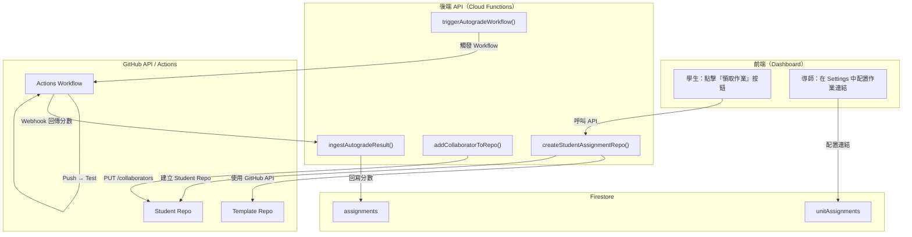

# GitHub API 原生整合計劃

## 概述

本計劃旨在在 GitHub Classroom 停止支援前，將其核心功能直接整合到 Vibe Coding 平台。通過自建邀請派發、自動評分、權限管理等功能，實現對 Classroom 功能的完全替代，並提供更高度的客製化與安全控制。

**目標效果**：
- 學生一鍵領取作業，無需進入組織 Pending 流程
- 自動為學生建立私有 Repo，直接授予 Collaborator 權限
- 自動評分結果回寫到 Dashboard
- 教材同步與 PR 管理完全由系統控制
- 推薦連結與分潤機制無縫整合

---

## 1. 整體架構設計

### 1.1 現狀分析

**GitHub Classroom 在 Vibe Coding 中的作用**：
- 建立學生作業 Repo（Template Repo → Student Repo）
- 發送邀請連結與權限管理
- 觸發自動評分 Workflow（GitHub Actions）
- 提供 Feedback Pull Request 機制

**問題點**：
- Classroom 依賴組織成員邀請，學生有時卡在 Pending
- Classroom API 功能有限，難以客製化
- GitHub 官方已宣佈停止支援
- 無法與 Vibe Coding 的導師分潤、推薦連結等機制深度整合

### 1.2 新架構目標



### 1.3 規模化與多導師架構規劃

當教材規模化（多班級、多老師）時，最需要規劃的架構問題是：如何有效隔離不同班級的作業、管理 GitHub Actions 的計費與額度限制，並提供順暢的交接流程。

#### 1.3.1 一堂課一個組織（推薦：最乾淨、最好交接）

**做法**：每位新老師（或每個新班級）都建立一個全新的 GitHub Organization。

* **流程**：
  1. **建立組織**：新老師建立一個全新的 Org（例如 `vibe-coding-2026-fall`）。
  2. **複製樣板**：新老師到您的官方教材（Upstream Template Repo）點擊 **Fork**，將樣板複製一份到他自己的 Org 下，成為他那一班的專屬樣板。
  3. **綁定與派發**：他可以使用 GitHub Classroom 或自建 API 腳本，將自訂的樣板與其 Org 綁定，並把「領取作業連結」發給學生。

* **優點**：
  - **完全隔離**：不同班級的學生和作業 Repo 絕對不會混在一起。
  - **獨立計費與額度**：每個 Org 擁有獨立的 GitHub Actions 免費額度，不會互相排擠或共用帳單。
  - **方便結業與歸檔**：學期結束後，該組織可直接封存或歸檔，完全不影響其他正在進行的班級。

#### 1.3.2 核心不變的「黃金工作流」

不論採取何種分班或多導師方案，新老師開課的核心步驟都符合開源協作與分散式管理的精神：

1. **繼承與客製化（Fork）**：
   新老師不直接使用上游的原始 Repo 派發作業，而是先 **Fork** 一份。若新老師想針對自己的班級加強特定教學單元（例如藍牙 BLE 教學），他可以直接修改自己組織下的樣板，而不會污染官方標準教材。
2. **回饋母版（PR）**：
   如果新老師在教學過程中發現原始教材的 Bug，或是優化了自動評分（Autograding）腳本，可以發起 **Pull Request (PR)** 回到您的 Upstream 母版，讓 Vibe Coding 的教材生態系越做越強大。
3. **學生複製（Clone/Generate）**：
   學生透過老師提供的管道（Classroom 連結或自建 API 網頁），複製屬於自己的私有作業 Repo 並開始撰寫程式。

#### 1.3.3 未來營運與擴展建議

若未來要開放授權給其他老師或學校開課，最省心且符合分散式架構的策略為：

> [!TIP]
> **讓新老師自己去建立 GitHub 組織，並請他 Fork 您的 Template Repo。您只需要扮演「教材上游的維護者（Upstream Maintainer）」，而不需要幫每一位老師管理他們的學生帳號、GitHub 組織與帳單。**
> 
> 這樣做，您的 Vibe Coding 教學法與平台架構才能真正做到無痛的「開枝散葉」與無限擴充！

---

## 2. 實作階段（Phase 計劃）

### Phase 1：基礎 API 層（第 1-2 周）

#### 1.1 GitHub Token 管理
- 建立 GitHub Personal Access Token（Fine-grained）
- 存入 Firebase Secrets（`GITHUB_API_TOKEN`）
- 限制 Token 權限：僅限 `vibe-coding-classroom` Org 內的操作
- 權限清單：`repos`, `workflows`, `admin:org_hook`

#### 1.2 安裝 PyGithub 或 GitHub REST 客戶端
```
# functions/package.json 新增
"@octokit/rest": "^19.0.0"  # 或保持 Node.js 原生 fetch
```

#### 1.3 建立基礎 HTTP 函數框架
```javascript
// functions/github-api-helper.js
class GitHubAPIHelper {
    constructor(token) {
        this.token = token;
        this.baseUrl = "https://api.github.com";
    }

    async createRepoFromTemplate(orgName, templateRepo, newRepoName, isPrivate = true) {
        // POST /repos/{owner}/{template_repo}/generate
    }

    async addCollaborator(orgName, repoName, username, permission = 'push') {
        // PUT /repos/{owner}/{repo}/collaborators/{username}
    }

    async removeCollaborator(orgName, repoName, username) {
        // DELETE /repos/{owner}/{repo}/collaborators/{username}
    }

    async getRef(orgName, repoName, ref) {
        // GET /repos/{owner}/{repo}/git/ref/{ref}
    }

    async createRef(orgName, repoName, ref, sha) {
        // POST /repos/{owner}/{repo}/git/refs
    }

    async createPullRequest(orgName, repoName, title, body, head, base) {
        // POST /repos/{owner}/{repo}/pulls
    }
}

module.exports = GitHubAPIHelper;
```

---

### Phase 2：學生邀請派發流程（第 3-4 周）

#### 2.1 前端交互改進
- 在 Dashboard 「領取作業」按鈕旁加入「正在建立倉庫...」的進度提示
- 成功後：直接顯示 Repo 連結 + 複製按鈕
- 失敗時：顯示友善錯誤信息 + 重試按鈕

#### 2.2 後端 Cloud Function 實作

**新增函數：`createStudentRepository`**

```javascript
// 觸發條件：學生點擊「領取作業」
exports.createStudentRepository = onCall(async (request) => {
    const { unitId } = request.data;
    const user = request.auth;

    // 1. 驗證：學生是否已付費或有資格
    const hasAccess = await checkPaymentAuthorization(user.uid, unitId);
    if (!hasAccess) throw new HttpsError('permission-denied', '未付費');

    // 2. 檢查是否已建立過此 Repo
    const assignment = await db.collection('assignments')
        .where('userId', '==', user.uid)
        .where('unitId', '==', unitId)
        .limit(1)
        .get();

    if (!assignment.empty && assignment.docs[0].data().repositoryUrl) {
        // 已建立，直接回傳現有連結
        return { repositoryUrl: assignment.docs[0].data().repositoryUrl };
    }

    // 3. 取得對應的 Template Repo
    const unitConfig = await db.collection('metadata_lessons')
        .where('unitId', '==', unitId)
        .limit(1)
        .get();

    const templateRepo = unitConfig.docs[0]?.data().templateRepo || `starter-${unitId}`;

    // 4. 呼叫 GitHub API 建立 Repo
    const ghHelper = new GitHubAPIHelper(process.env.GITHUB_API_TOKEN);
    const newRepoName = `${unitId}-${user.uid.substring(0, 8)}`; // 例：01-vscode-abc12345
    const studentRepo = await ghHelper.createRepoFromTemplate(
        'vibe-coding-classroom',
        templateRepo,
        newRepoName,
        true // private
    );

    // 5. 將學生加為 Collaborator
    await ghHelper.addCollaborator(
        'vibe-coding-classroom',
        newRepoName,
        user.email.split('@')[0], // 假設 GitHub username = email prefix
        'push'
    );

    // 5.5 建立 Feedback PR 機制（永遠不合併的 PR，用於非同步 Code Review）
    // 5.5.1 取得 main 分支最新 commit sha
    const mainRef = await ghHelper.getRef('vibe-coding-classroom', newRepoName, 'heads/main');
    // 5.5.2 建立 feedback 分支
    await ghHelper.createRef('vibe-coding-classroom', newRepoName, 'refs/heads/feedback', mainRef.object.sha);
    // 5.5.3 建立從 main 合併至 feedback 的 PR
    const feedbackPR = await ghHelper.createPullRequest(
        'vibe-coding-classroom',
        newRepoName,
        'classroom-feedback',
        '這是您的作業回饋專區。您每次 push 程式碼後，自動評分結果與老師的評語都會顯示在這裡！\n\n⚠️ **請勿點擊 Merge 按鈕**，保持此 PR 開啟直到學期結束。',
        'main',
        'feedback'
    );

    // 6. 回寫到 Firestore
    const assignmentRef = db.collection('assignments').doc();
    await assignmentRef.set({
        userId: user.uid,
        unitId,
        repositoryUrl: studentRepo.html_url,
        repositoryName: newRepoName,
        feedbackPullRequestUrl: feedbackPR.html_url,
        createdAt: admin.firestore.FieldValue.serverTimestamp(),
        status: 'active'
    });

    return { repositoryUrl: studentRepo.html_url, feedbackPullRequestUrl: feedbackPR.html_url };
});
```

#### 2.3 錯誤處理與重試機制
- 如果 GitHub API 暫時不可用，將失敗請求放入 Firestore 隊列
- 定時任務每 5 分鐘檢查並重試失敗的請求

#### 2.4 Feedback PR 核心機制與設計

在原生的自建系統中，整合 **Feedback PR（回饋拉取請求）** 機制是提升師生 Code Review 與互動品質的核心關鍵。

##### 2.4.1 運作原理（永遠不合併的 PR）
- **建立基底**：在初始化學生作業倉庫時，系統會自動在 Repo 中建立一個以 `main` 最新 Commit 為基底的 `feedback` 分支。
- **發起拉取**：立即建立一個 **從 `main` 合併到 `feedback`** 的 Pull Request。
- **動態追蹤**：學生此後所有的程式碼開發與 `push` 都直接提交至 `main` 分支。由於此 PR 已經開啟，GitHub 將會**自動且動態地更新** `main` 與 `feedback` 的差異（Diff）。

##### 2.4.2 機制核心優勢
- **精準的程式碼級討論**：老師或助教無需將學生代碼 Clone 至本地。只需直接打開 PR 頁面，即可滑鼠點擊任意一行程式碼直接留言（例如：「*這行 ESP32 BLE 廣播設定缺少了欄位，請參考單元三*」），學生亦可直接回覆，形成精準的非同步討論。
- **自動評分與 Actions 日誌看板**：GitHub Actions 自動評分的執行結果、分數及錯誤 Log，可透過 Webhook 自動推送到此 Feedback PR 的留言板。學生在一個頁面就能掌握得分與出錯細節。

##### 2.4.3 實作範例（以 Python API 模擬）
```python
# 1. 幫學生建立 feedback 分支（以目前的 main 分支為基底）
main_branch = student_repo.get_branch("main")
student_repo.create_git_ref(
    ref="refs/heads/feedback", 
    sha=main_branch.commit.sha
)

# 2. 建立 Pull Request (從 main 合併到 feedback)
feedback_pr = student_repo.create_pull(
    title="classroom-feedback",
    body="這是您的作業回饋專區。您每次 push 程式碼後，自動評分結果與老師的評語都會顯示在這裡！\n\n⚠️ **請勿點擊 Merge 按鈕**，保持此 PR 開啟直到學期結束。",
    base="feedback",  # 接收變更的基底分支
    head="main"       # 學生提交變更的來源分支
)
```

##### 2.4.4 防呆與分支保護限制
- **預防手動 Merge**：若學生點擊「Merge」會導致 PR 關閉，動態更新失效。
- **防範對策**：系統可在建庫後，自動透過 GitHub API 設定 **Branch Protection Rules（分支保護規則）**：
  - 限制學生的 GitHub 帳號對 `feedback` 分支進行 Merge / Close 操作。
  - 確保該回饋通道在整個學期中保持暢通。

---

### Phase 3：自動評分整合（第 5-6 周）

#### 3.1 GitHub Actions Workflow 範本優化
```yaml
# vibe-coding-classroom-starter/(.github/workflows/autograde.yml)
name: 作業自動評分
on: 
  push:
    branches: [ main ]
  pull_request:
    branches: [ main ]

env:
  VC_AUTOGRADE_URL: ${{ secrets.VC_AUTOGRADE_URL }}
  VC_AUTOGRADE_TOKEN: ${{ secrets.VC_AUTOGRADE_TOKEN }}

jobs:
  autograde:
    runs-on: ubuntu-latest
    steps:
      - uses: actions/checkout@v4

      # 設定測試環境（例如 Python）
      - uses: actions/setup-python@v5
        with:
          python-version: '3.10'

      # 執行測試
      - name: 執行單元測試
        id: test
        run: |
          python -m pytest tests/ --tb=short -v
        continue-on-error: true

      # 回傳分數給 Vibe System
      - name: 回傳自動評分結果
        if: always()
        run: |
          SCORE=$(python scripts/calculate_score.py)
          PAYLOAD='{"score": '$SCORE', "status": "${{ job.status }}", "commitSha": "${{ github.sha }}"}'
          SIGNATURE=$(printf %s "$PAYLOAD" | openssl dgst -sha256 -hmac "$VC_AUTOGRADE_TOKEN" | sed 's/^.* //')
          curl -X POST "$VC_AUTOGRADE_URL" \
            -H "X-Hub-Signature-256: sha256=$SIGNATURE" \
            -H "Content-Type: application/json" \
            -d "$PAYLOAD"
```

#### 3.2 Webhook 接收與分數回寫
- 現有的 `ingestGithubAutograde` 函數已支援 Webhook
- 新增驗證：確認來源必須是 `vibe-coding-classroom` Org

---

### Phase 4：導師配置與推薦連結（第 7-8 周）

#### 4.1 導師在 Settings 中配置作業連結
- UI：Settings 分頁新增「作業連結配置」區塊
- 允許導師為每個單元配置自建 Repo 的連結
- 存儲到 `users.tutorConfigs[unitId].customAssignmentUrl`

#### 4.2 推薦連結機制
- 推薦連結格式：`https://vibe-coding.tw/accept-assignment?referralCode=TUTOR_ID&unitId=UNIT_ID`
- 學生點擊後，自動：
  1. 檢驗推薦碼有效性
  2. 記錄 `assignments.referredByTutor`
  3. 建立作業 Repo
  4. 回寫分潤明細

#### 4.3 導師端自動化作業派發機制

要讓自建的自動化系統（例如用 Python API 或網頁表單）能夠順暢運作，**「老師」只需要提供以下 4 項核心資料**，系統就能在背後完全自動化地把「學生」與「屬於他的作業程式庫」綁定在一起：

##### 4.3.1 老師（系統管理員）需提供的 4 項核心資料
- **個人存取權杖 (Personal Access Token, PAT)**：這是系統代表老師去向 GitHub 呼叫 API 的「數位通行證」。
  - **建議類型**：使用 GitHub 新版的 **Fine-grained personal access tokens**。
  - **權限範圍 (Permissions)**：
    - **Repository permissions**: `Administration` (Read & Write), `Contents` (Read & Write), `Metadata` (Read-only)。
    - **Organization permissions**: `Members` (Read-only，用來檢查學生帳號)。
- **組織名稱 (Organization Name)**：作業程式庫要建立在外的哪一個 GitHub 組織空間（例如：`yuilaing-classroom`）。
- **原始教材樣板名稱 (Template Repository Name)**：本次作業要複製哪一個母版教材。
- **學生與學號對照名單 (Student Roster)**：一份包含學生識別碼與 GitHub 帳號的對照表（通常是由系統自動提供或匯入）。

##### 4.3.2 自動化連結與建庫邏輯
當系統取得上述 4 項資料後，後端的執行邏輯如下：
1. **讀取學生資料**。
2. **生成專屬名稱**：系統自動拼接出標準化的作業倉庫名稱，格式為：`作業前綴-學號`（例如：`tw-common-developer-identity-115001`）。
3. **複製倉庫 (API)**：系統拿著老師的 `Token`，呼叫 GitHub API，命令組織從 `tw-common-developer-identity` 複製出一個名為 `tw-common-developer-identity-115001` 的 **Private Repository**。
4. **直接綁定學生 (API)**：系統立刻呼叫新增協力者 API，將學生的 GitHub 帳號（例如 `xiaoming-chang`）直接加入 `tw-common-developer-identity-115001` 中，並給予 `Push`（寫入）權限。

---

### Phase 5：教材同步與 PR 機制（第 9-10 周）

#### 5.1 Template Repo 更新流程
```
1. 更新 canonical template repo (vibe-coding-template/*)
2. 系統批次偵測更新
3. 對所有學生 Repo 建立同步 PR（從 canonical 提取差異）
4. 導師在 Dashboard 審核並 Merge
5. 學生在他們的 Repo 拉入更新
```

#### 5.2 PR 管理 API
```javascript
// 新增函數：syncTemplateToStudentRepo()
// 用途：建立同步 PR
async function createSyncPR(orgName, studentRepoName, templateRepoName) {
    // 1. 比較 canonical 與 student repo 差異
    // 2. 建立分支 (sync/YYYY-MM-DD)
    // 3. 建立 PR 到 student repo
    // 4. 返回 PR URL
}
```

---

## 3. 技術實作細節

### 3.1 GitHub API 端點清單

| 操作 | 端點 | 方法 | 說明 |
| --- | --- | --- | --- |
| 建立 Repo（from template） | `/repos/{owner}/{template_repo}/generate` | POST | PyGithub / Octokit 原生支援 |
| 新增協力者 | `/repos/{owner}/{repo}/collaborators/{username}` | PUT | 設定 `permission: 'push'` |
| 移除協力者 | `/repos/{owner}/{repo}/collaborators/{username}` | DELETE | 清除權限 |
| 建立 Branch | `/repos/{owner}/{repo}/git/refs` | POST | 用於教材同步 |
| 建立 Pull Request | `/repos/{owner}/{repo}/pulls` | POST | 同步 Template 更新 |
| 取得 Repo 訊息 | `/repos/{owner}/{repo}` | GET | 驗證 Repo 狀態 |
| 建立 Webhook | `/repos/{owner}/{repo}/hooks` | POST | 接收 Actions 完成通知 |

### 3.2 Token 安全管理
- **儲存位置**：Firebase Secrets → `GITHUB_API_TOKEN`
- **權限級別**：Fine-grained Personal Access Token（推薦）
  - Repository：`vibe-coding-classroom/*` 及 `vibe-coding-template/*`
  - Permissions：
    - `contents` (read/write)
    - `pull_requests` (read/write)
    - `workflows` (read/write)
    - `administration` (read)
- **輪換策略**：每 3 個月更新一次 Token
- **監控**：GitHub Audit Log 定期檢查異常操作

### 3.3 Rate Limiting 對策
- GitHub API 限制：每小時 5000 次請求（認證用戶）
- **預估使用**：
  - 每個學生建立 Repo：~5 次 API 呼叫
  - 每次教材同步：~10 次 API 呼叫
  - 月度推算：100 學生 × 5 作業 × 5 呼叫 ≈ 2500 次（安全範圍內）
- **應對方案**：
  - 批次操作使用 GraphQL（減少呼叫數）
  - 超過臨界值時排隊並延遲執行

---

## 4. 遷移策略

### 4.1 平行運行期（Phase 1-4 期間）
- 新系統與 Classroom 同時運行
- 學生可選擇使用「自建派發」或「Classroom 邀請」
- 後端同時支援兩種作業提交方式

### 4.2 逐步遷移（Week 9-12）
- 預設新系統，Classroom 作為備選
- 通知所有導師更新教材連結
- 檢查現有作業 Repo 的自動評分是否正常轉移

### 4.3 完全棄用（Week 12+）
- 關閉 Classroom 新邀請
- 現有 Classroom Repo 標記為唯讀
- 所有新學生強制使用自建系統

### 4.4 回檔計劃
- 保留所有 Classroom Repo 的 Git Mirror
- 允許學生導出已完成的作業歷史

---

## 5. 前端改進建議

### 5.1 「領取作業」流程優化
```
當前：「進入教室寫作業」→ Classroom 邀請連結
改進：「領取作業」（一鍵）→ 建立 Repo → 直接開啟 IDE
```

### 5.2 Dashboard 新增區塊
- **我的作業 Repo**：快速連結到所有已建立的 Repo
- **同步狀態**：顯示是否有 Template 更新待審核
- **自動評分結果**：即時顯示最新分數

### 5.3 導師端改進
- **作業連結管理**：統一配置所有單元的自建 Repo 連結
- **同步審核面板**：批量審核與 Merge 教材更新 PR
- **學生 Repo 列表**：篩選、搜尋、快速存取
- **「新開班老師」最簡化作業派發介面**：
  為新老師提供極簡的後台操作介面，僅需填寫/選擇以下四個主要欄位：
  1. **GitHub Token 🔑** (個人存取權杖 PAT 輸入欄)
  2. **Organization 名稱 🏢** (目標組織空間)
  3. **Template Repo 名稱 📦** (作業樣板選擇)
  4. **選課學生名單 👥** (學號與 GitHub 帳號對照表匯入)
  * 提供「一鍵派發作業」按鈕。點擊後系統自動在背景建庫、完成授權，實現 **「Upstream (母版) ➔ Downstream (各班樣板) ➔ Student Repo (學生作業)」** 的完整生態系，降低老師的技術門檻。

---

## 6. 測試計劃

### 6.1 單元測試（Unit Tests）
```javascript
// tests/github-api-helper.test.js
describe('GitHubAPIHelper', () => {
    it('should create repo from template', async () => { /* ... */ });
    it('should add collaborator with correct permission', async () => { /* ... */ });
    it('should handle rate limiting gracefully', async () => { /* ... */ });
});
```

### 6.2 整合測試（Integration Tests）
1. **E2E 流程**：
   - 學生點擊「領取作業」
   - Repo 自動建立
   - 直接開啟 IDE
   - Push 程式碼
   - 自動評分觸發
   - 分數回寫 Dashboard

2. **故障場景**：
   - GitHub API 超時 → 重試機制
   - 學生已建立 Repo → 回傳現有連結
   - 推薦碼失效 → 友善提示

### 6.3 效能測試
- 100 學生同時建立 Repo（批次試驗）
- API 回應時間 < 5 秒
- Webhook 處理延遲 < 10 秒

---

## 7. 風險評估與應對

| 風險 | 影響 | 降低方案 |
| --- | --- | --- |
| GitHub Token 洩漏 | 他人可存取所有 Org Repo | Fine-grained Token + Secrets 管理 |
| Rate Limiting 觸發 | 邀請派發中斷 | GraphQL + 批次操作 + 排隊機制 |
| API 更新不相容 | 功能故障 | 定期更新 SDK + 測試 |
| 學生 Repo 權限混亂 | 學生無法 Push | 加入 Collaborator 驗證 + 定時審計 |
| Webhook 簽名驗證失敗 | 分數無法回寫 | 嚴格驗證 + Fallback 機制 |

---

## 8. 實作時程表

| 周期 | 任務 | 負責 | 交付物 |
| --- | --- | --- | --- |
| Week 1-2 | 基礎 API 層 + Token 管理 | Backend | `github-api-helper.js` |
| Week 3-4 | 學生邀請派發 + 前端改進 | Backend + Frontend | `createStudentRepository()` + UI |
| Week 5-6 | 自動評分整合 | DevOps | Workflow 範本 + 回寫驗證 |
| Week 7-8 | 導師配置 + 推薦連結 | Backend + Frontend | Settings UI + API |
| Week 9-10 | 教材同步與 PR 管理 | Backend | `syncTemplateToStudentRepo()` |
| Week 11-12 | 整合測試 + 平行運行 | QA | 測試報告 + 遷移檢查清單 |

---

## 9. 成功標準

- [ ] 新系統 100% 相容 Classroom 的邀請派發
- [ ] 自動評分結果成功回寫 ≥ 95%
- [ ] 導師推薦連結點擊率 ≥ 90%
- [ ] 教材同步 PR 審核流程順暢
- [ ] API 平均回應時間 < 2 秒
- [ ] 零 Token 安全事件

---

## 附錄 A：GitHub API 最小範例

### Python 範例（PyGithub）
```python
from github import Github

# 初始化
g = Github("你的_GITHUB_TOKEN")
org = g.get_organization("vibe-coding-classroom")
template = org.get_repo("starter-vscode")

# 建立 Repo
new_repo = org.create_repo(
    name="vscode-student-001",
    private=True,
    description="Student assignment repo"
)

# 新增協力者
new_repo.add_to_collaborators("student-github-username", permission="push")

print(f"Created: {new_repo.html_url}")
```

### Node.js 範例（Octokit）
```javascript
const { Octokit } = require("@octokit/rest");

const octokit = new Octokit({ auth: 'your-token' });

// 建立 Repo（from template）
const repo = await octokit.repos.createUsingTemplate({
    template_owner: 'vibe-coding-classroom',
    template_repo: 'starter-vscode',
    owner: 'vibe-coding-classroom',
    name: 'vscode-student-001',
    private: true
});

// 新增協力者
await octokit.repos.addCollaborator({
    owner: 'vibe-coding-classroom',
    repo: 'vscode-student-001',
    username: 'student-github-username',
    permission: 'push'
});

console.log(repo.data.html_url);
```

---

## 附錄 B：Firestore 資料結構更新

### assignments collection 新增欄位
```
{
    id: "uuid",
    userId: "user-id",
    unitId: "unit-id",
    
    // 新增欄位
    repositoryUrl: "https://github.com/vibe-coding-classroom/vscode-student-001",
    repositoryName: "vscode-student-001",
    createdVia: "native-api",  // "classroom" or "native-api"
    
    // 既有欄位
    autoGrade: { ... },
    grade: 100,
    status: "completed"
}
```

### users/{uid}/tutorConfigs[unitId] 新增欄位
```
{
    authorized: true,
    customAssignmentUrl: "https://github.com/vibe-coding-classroom/starter-vscode",
    
    // 既有欄位
    assignmentUrl: "https://classroom.github.com/..."
}
```

---

最後更新：2026-05-28
計劃版本：v1.0
