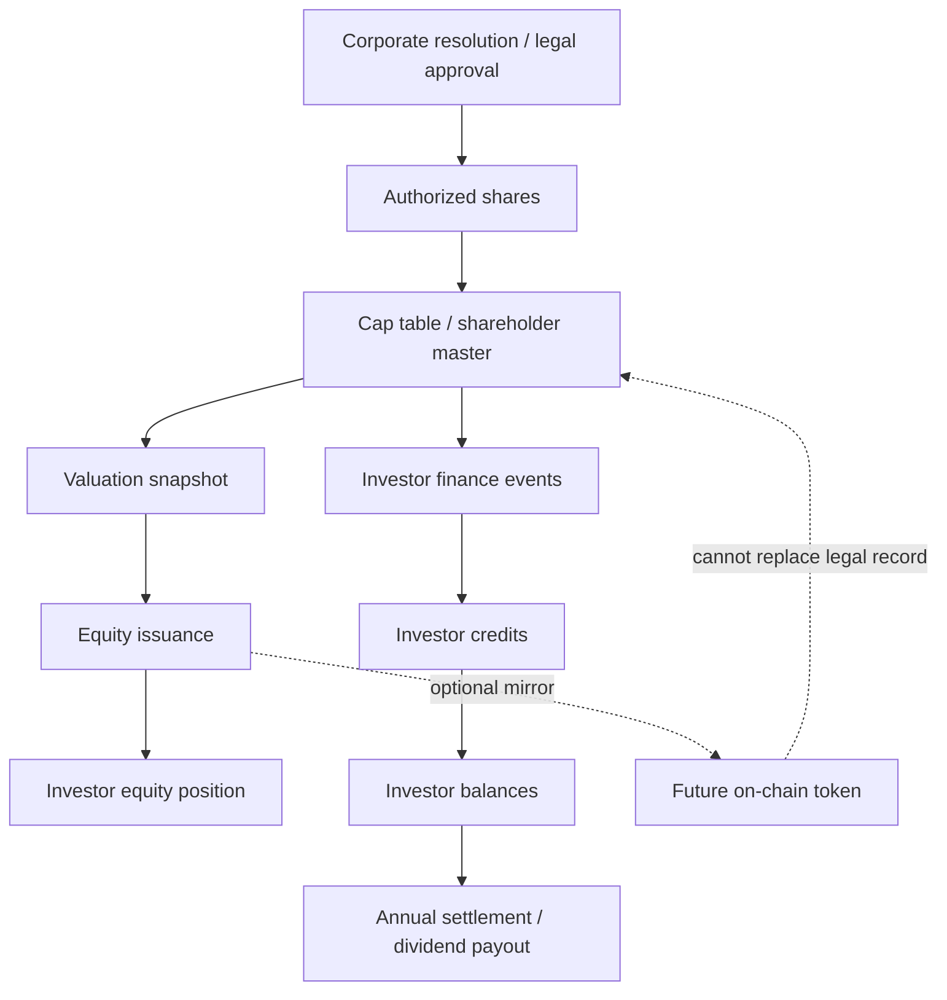

# Cap Table & Tokenization Strategy

Last updated: 2026-06-04

## 1. Why this document exists

This document defines how Vibe Coding should manage equity, valuation, and future tokenization options without confusing legal ownership with payment rails or crypto mechanics.

The core idea is:
- `cap table` is the source of truth for ownership
- valuation snapshots only define pricing for a specific issuance moment
- crypto can be used for payments, settlement, or treasury, but it should not replace the legal ownership ledger
- if equity is ever tokenized, the token remains a security and still needs the same compliance controls

## 2. Key definitions

### 2.1 Authorized shares
The maximum share count approved in the company constitution or equivalent legal documents.
- Example: 10,000,000 shares
- This is an upper bound, not the live ownership picture
- It changes only through formal corporate actions

### 2.2 Issued shares / outstanding shares
The shares that have actually been issued and are currently held by shareholders.
- This number may change over time
- It can increase with new issuance
- It can decrease with buyback, cancellation, or retirement

### 2.3 Cap table
The authoritative ownership ledger.
- Records who owns what
- Tracks when ownership changed
- Preserves audit history
- Must remain consistent with the legal shareholder register

### 2.4 Valuation snapshot
A frozen pricing reference used at a specific moment.
- Example: pre-money or post-money valuation
- Used to compute issue price
- Must not be retroactively rewritten when a new valuation arrives

### 2.5 Transaction price
The actual negotiated price for a specific issuance or transfer.
- Usually derived from the valuation snapshot
- Not always equal to a public market price
- For private companies, there may be no public market price at all
- A realized trade price is the strongest market validation for that moment, but it is not required for value to exist in the first place

## 3. What is similar to crypto, and what is not

### Similar
- Both systems can be ledger-based
- Both can have immutable event history
- Both can support address / account style ownership mapping
- Both can support automated reconciliation

### Not similar
- Shares are not created by mining or consensus
- Equity ownership is governed by company law and corporate approval
- A tokenized share is still a security, not a generic cryptocurrency
- The legal shareholder register still matters even if the record is mirrored on-chain

## 4. Recommended operating model

### 4.1 Keep the legal cap table off-chain
The system should treat the internal ownership ledger as the master record.
- It can be implemented in Firestore
- It can later be mirrored to a blockchain if needed
- But the on-chain record should remain secondary unless the company explicitly chooses a tokenized-security model

### 4.2 Use valuation snapshots only for pricing
Each issuance or service-for-equity event should reference one frozen valuation snapshot.
- Do not recalculate past issuance records when the valuation changes
- Store the valuation used at the time of issuance
- Keep historical snapshots for auditability

### 4.3 Separate equity from cashflow
Investment and equity issuance are different from operational income / expense ledgers.
- Operational income / expense should continue to feed the investor ledger if needed
- Equity issuance should produce a distinct issuance record
- Dividend settlement should be a third step, not a price recalculation step

### 4.4 Keep tokenization optional
If tokenization is ever introduced:
- the token should represent the ownership record, not replace the legal contract
- transfer should be permissioned
- KYC / AML / whitelist controls should apply
- custody and recovery policies must be defined

## 5. System architecture

## 6. Data model mapping

The current system already has the following collections:
- `investor_profiles`
- `valuation_snapshots`
- `equity_issuances`
- `investor_equity_positions`
- `investor_finance_events`
- `investor_credits`
- `investor_balances`
- `investor_annual_settlements`
- `balance_sheet_snapshots`

Recommended meaning:
- `investor_profiles`: who participates in the equity / credit system
- `valuation_snapshots`: frozen pricing snapshots
- `equity_issuances`: new ownership or service-for-equity events
- `investor_equity_positions`: current ownership positions
- `investor_finance_events`: income / expense / manual adjustment events
- `investor_credits`: per-investor event allocation
- `investor_balances`: current running balance
- `investor_annual_settlements`: year-end dividend and ending balance record
- `balance_sheet_snapshots`: periodic assets/liabilities snapshots used for NAV and per-share NAV comparisons

## 7. Process rules

### 7.1 Initial setup
1. Decide the authorized share count.
2. Load founder / original shareholder records into the cap table.
3. Record each founder’s initial share units or share count.
4. Freeze the initial valuation snapshot if there is a priced issuance.

### 7.2 New issuance
1. Create or select a valuation snapshot.
2. Create an issuance record.
3. Compute issue price from valuation and share basis.
4. Update the ownership position.
5. Preserve the historical issuance record unchanged.

### 7.3 Service-for-equity / employee / consultant offset
1. Record the non-cash consideration.
2. Reference the same valuation snapshot discipline as cash investors.
3. Mark the participant type clearly.
4. If vesting applies, store it explicitly.
5. Do not merge these records into the operational revenue-share ledger.

### 7.4 Annual settlement
1. Roll the yearly credits and balances.
2. Compute dividend payable.
3. Pay cash if a payout account exists.
4. Keep the ending balance as next year’s opening balance.

## 8. What should not be mixed together

Do not mix these domains:
- founder cap table
- investor equity issuance
- operational income / expense events
- revenue share for tutors / agents
- dividend settlement
- crypto payment rails

Each domain can be linked, but it should remain independently auditable.

## 9. Practical recommendation for Vibe Coding

For the current product stage:
- keep the cap table and ownership master off-chain
- use crypto only as an optional payment or treasury tool
- keep valuation snapshots as the official pricing reference
- keep the investor ledger separated from revenue-sharing logic
- add tokenization only after legal, tax, and custody design are ready

## 10. Related documents

- Implementation spec: [Cap Table Implementation Spec](./cap-table-implementation-spec.md)
- Investor overview: [Cap Table & Tokenization Overview](./cap-table-investor-overview.md)
- [Investor Ledger System](./investor-ledger-system.md)
- [Valuation Model](./valuation-model.md)
- [Funding Roadmap](./funding-roadmap.md)
- [Database Schema](../database.md)

## 11. External references

- SEC: [Statement on Tokenized Securities](https://www.sec.gov/newsroom/speeches-statements/corp-fin-statement-tokenized-securities-012826-statement-tokenized-securities)
- FINRA: [Crypto Assets - Buying and Selling](https://www.finra.org/investors/investing/investment-products/crypto-assets/buying-selling)
