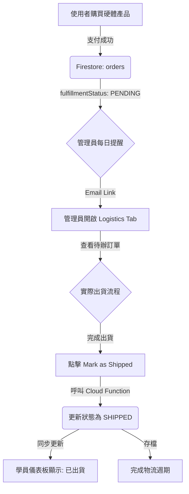

# Logistics Management Minimum Viable Product (MVP)
**Version**: 2026.05.13.V2
**Objective**: Define the automated management and fulfillment protocol for physical hardware products.

## 1. System Overview
The Logistics MVP governs the lifecycle of "Physical Products" from payment confirmation to final shipment. It centralizes order tracking for administrators and provides transparency for students.



## 2. Fulfillment Lifecycle States
| State | Description | Trigger |
| :--- | :--- | :--- |
| `PENDING` | Default state for successful orders containing physical items. | `paymentNotify` success flow. |
| `SHIPPED` | Order has been processed and handed over to the logistics provider. | Admin clicks "Mark as Shipped" in Logistics Tab. |
| `ARCHIVED` | Completed and historic orders (Future expansion). | Manual or automated cleanup. |

## 3. Data Integration & Aggregation

### 3.0 Checkout Guardrail (`initiatePayment`)
- For orders containing physical items, checkout must include complete logistics payload:
  - receiver name
  - receiver phone
  - store ID or shipping address
- If missing, API returns `400` and the order is rejected before payment.

### 3.1 Backend: `getDashboardData`
The protocol requires `getDashboardData` to return a `hardwareOrders` array exclusively for users with `role === 'admin'`.
- **Logic**: Filters all `SUCCESS` orders in the `orders` collection.
- **Criteria**: Matches items with `isPhysical: true` or legacy IDs in `physicalUnitIds`.
- **Payload**: Includes `uid`, `email`, `amount`, `paidAt`, `logistics`, `shippingContact{name,phone}`, `shippingAddress`, and `fulfillmentStatus`.
- **Quality Flag**: `logisticsMissing` indicates paid physical order with incomplete logistics data (for admin remediation).

### 3.2 Backend: `markOrderShipped`
An atomic Cloud Function that transitions an order's `fulfillmentStatus` to `SHIPPED`.
- **Permission**: Requires `requesterRole === 'admin'`.
- **Side Effects**: Logs the shipment timestamp and sends student shipment confirmation email via `sendOrderShippedEmail`.

## 4. Admin Interface Protocol (`dashboard.js`)

### 4.1 Access Control
- The **Shipment Management Tab** (`#tab-btn-shipments`) must only be visible if `myRole === 'admin'`.
- Access via URL parameter `?tab=shipments` must be validated against user roles.
- Backward compatibility: legacy link `?tab=logistics` is redirected to `shipments`.

### 4.2 Rendering (`renderLogisticsTab`)
- **Data Source**: `dashboardData.hardwareOrders`.
- **View**: A comprehensive table displaying order ID, customer info, item details, receiver contact info (name/phone), and logistics address metadata (CVS store or receiver address).
- **Action**: Provides a "Mark as Shipped" button for any order in `PENDING` status.

## 5. Communication Protocol (`emailService.js`)

### 5.1 Admin Reminders (`sendAdminShipmentReminder`)
- **Trigger**: Daily 9:30 AM cron job.
- **Protocol**: Aggregates all `PENDING` shipments and sends a summary to the admin.
- **Deep Link**: Must point to `${APP_BASE_URL}/dashboard.html?tab=shipments`.

### 5.2 Student Confirmation (`sendPaymentSuccessEmail`)
- **Trigger**: Immediate post-payment.
- **Protocol**: Notifies the student of successful hardware registration.
- **Deep Link**: Points to `${APP_BASE_URL}/dashboard.html?tab=overview`（學生在 Overview 檢視個人出貨狀態卡片）。

### 5.3 Student Shipment Notice (`sendOrderShippedEmail`)
- **Trigger**: Admin marks order as shipped (`markOrderShipped`).
- **Protocol**: Notifies student that hardware order is now `SHIPPED`, including order/item summary and logistics metadata (if available).
- **Deep Link**: Points to `${APP_BASE_URL}/dashboard.html?tab=overview`（與目前學生端 UI 一致）。

## 6. Implementation Notes
- **Zero-Cost Strategy**: Relies on Cloud Functions `onCall` and `Firestore` triggers without expensive 3rd party logistics API polling (manual transition to `SHIPPED`).
- **Data Integrity**: Logistics information (e.g., ECPay CVS info) is stored directly in the `orders` document under the `logistics` key.
- **Notification Spec**: See `docs/email-notifications.md` for delivery matrix and failure handling.

## 7. Batch Recovery Tool (ECPay -> Firestore)
Script: `functions/scripts/recover_ecpay_logistics.js`

Purpose:
- Query ECPay logistics API for orders marked `logisticsMissing=true` (or specific order IDs)
- Recover contact/address fields
- Write back to Firestore `orders.logistics`

Modes:
- `--dry-run` (default): query + report only, no write
- `--apply`: query + write back

Examples:
```bash
node functions/scripts/recover_ecpay_logistics.js --dry-run --limit=50
node functions/scripts/recover_ecpay_logistics.js --apply --limit=50
node functions/scripts/recover_ecpay_logistics.js --apply --order-ids=VIBE123,VIBE456
```

Required env vars:
- `ECPAY_MERCHANT_ID`
- `ECPAY_HASH_KEY`
- `ECPAY_HASH_IV`

Optional env vars:
- `ECPAY_LOGISTICS_QUERY_URL` (default: `https://logistics.ecpay.com.tw/Helper/QueryLogisticsTradeInfo/V5`)

Write-back fields:
- `orders.logistics`
- `orders.logisticsMissing`
- `orders.logisticsRecoveredAt`
- `orders.logisticsRecoveredSource = "ecpay_batch_tool"`
