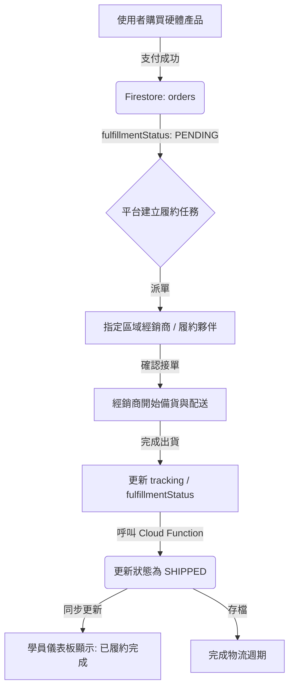

# Logistics Management Minimum Viable Product (MVP)
**Version**: 2026.05.13.V2
**Objective**: Define the automated management and fulfillment protocol for physical hardware products.

## 1. System Overview
The Logistics MVP governs the lifecycle of "Physical Products" from payment confirmation to final fulfillment. In the target operating model, Vibe Coding centrally collects payment, while local distributors / fulfillment partners handle physical delivery to end customers. It centralizes order and partner tracking for administrators and provides transparency for students.



## 2. Fulfillment Lifecycle States
| State | Description | Trigger |
| :--- | :--- | :--- |
| `PENDING` | Default state for successful orders containing physical items. | `paymentNotify` success flow. |
| `ASSIGNED` | Fulfillment task has been routed to a distributor / partner. | Platform creates the fulfillment task. |
| `ACCEPTED` | Distributor accepted the task and is preparing shipment. | Partner confirms the order. |
| `SHIPPED` | Order has been fulfilled / shipped by the distributor / logistics partner. | Distributor / partner updates tracking or admin confirms fulfillment completion. |
| `ARCHIVED` | Completed and historic orders (Future expansion). | Manual or automated cleanup. |

## 3. Data Integration & Aggregation

### 3.0 Checkout Guardrail (`initiatePayment`)
- For orders containing physical items, checkout must include complete logistics payload:
  - receiver name
  - receiver phone
  - store ID or shipping address
- If missing, API returns `400` and the order is rejected before payment.

### 3.1 Backend: `getDashboardData`
The protocol requires `getDashboardData` to return a `hardwareOrders` array exclusively for users with `role === 'admin'`.
- **Logic**: Filters all `SUCCESS` orders in the `orders` collection.
- **Criteria**: Matches items with `isPhysical: true` or legacy IDs in `physicalUnitIds`.
- **Payload**: Includes `uid`, `email`, `amount`, `paidAt`, `logistics`, `shippingContact{name,phone}`, `shippingAddress`, and `fulfillmentStatus`.
- **Quality Flag**: `logisticsMissing` indicates paid physical order with incomplete logistics data (for admin remediation).

### 3.2 Backend: `markOrderShipped`
An atomic Cloud Function that transitions an order's `fulfillmentStatus` to `SHIPPED`.
- **Permission**: Requires `requesterRole === 'admin'`.
- **Side Effects**: Logs the shipment timestamp and sends student shipment confirmation email via `sendOrderShippedEmail`.

## 4. Admin Interface Protocol (`dashboard.js`)

### 4.1 Access Control
- The **Fulfillment Management Tab** (`#tab-btn-shipments`) now acts as the **Fulfillment Management** queue.
- Access via URL parameter `?tab=shipments` must be validated against user roles.
- Backward compatibility: legacy link `?tab=logistics` is redirected to `shipments`.

### 4.2 Rendering (`renderLogisticsTab`)
- **Data Source**: `dashboardData.hardwareOrders`.
- **View**: A comprehensive table displaying order ID, customer info, item details, fulfillment partner, receiver contact info (name/phone), and logistics address metadata (CVS store or receiver address).
- **Action**: Provides a fulfillment action button for orders in `PENDING` / `ASSIGNED` / `ACCEPTED` status.

## 5. Communication Protocol (`emailService.js`)

### 5.1 Admin Reminders (`sendAdminShipmentReminder`)
- **Trigger**: Daily 9:30 AM cron job.
- **Protocol**: Aggregates all pending fulfillment tasks and sends a summary to the admin / ops queue.
- **Deep Link**: Must point to `${APP_BASE_URL}/dashboard.html?tab=shipments`.

### 5.2 Student Confirmation (`sendPaymentSuccessEmail`)
- **Trigger**: Immediate post-payment.
- **Protocol**: Notifies the student of successful hardware registration.
- **Deep Link**: Points to `${APP_BASE_URL}/dashboard.html?tab=overview`（學生在 Overview 檢視個人出貨狀態卡片）。

### 5.3 Student Shipment Notice (`sendOrderShippedEmail`)
- **Trigger**: Distributor / partner marks order as shipped (`markOrderShipped`).
- **Protocol**: Notifies student that hardware order is now `SHIPPED` / fulfilled, including order/item summary and logistics metadata (if available).
- **Deep Link**: Points to `${APP_BASE_URL}/dashboard.html?tab=overview`（與目前學生端 UI 一致）。

## 6. Implementation Notes
- **Zero-Cost Strategy**: Relies on Cloud Functions `onCall` and `Firestore` triggers without expensive 3rd party logistics API polling (manual transition to `SHIPPED` / fulfillment completion).
- **Data Integrity**: Logistics information (e.g., ECPay CVS info / distributor delivery metadata) is stored directly in the `orders` document under the `logistics` key.
- **Notification Spec**: See `docs/email-notifications.md` for delivery matrix and failure handling.

## 7. Batch Recovery Tool (ECPay -> Firestore)
Script: `functions/scripts/recover_ecpay_logistics.js`

Purpose:
- Query ECPay logistics API for orders marked `logisticsMissing=true` (or specific order IDs)
- Recover contact/address fields
- Write back to Firestore `orders.logistics`

Modes:
- `--dry-run` (default): query + report only, no write
- `--apply`: query + write back

Examples:
```bash
node functions/scripts/recover_ecpay_logistics.js --dry-run --limit=50
node functions/scripts/recover_ecpay_logistics.js --apply --limit=50
node functions/scripts/recover_ecpay_logistics.js --apply --order-ids=VIBE123,VIBE456
```

Required env vars:
- `ECPAY_MERCHANT_ID`
- `ECPAY_HASH_KEY`
- `ECPAY_HASH_IV`

Optional env vars:
- `ECPAY_LOGISTICS_QUERY_URL` (default: `https://logistics.ecpay.com.tw/Helper/QueryLogisticsTradeInfo/V5`)

Write-back fields:
- `orders.logistics`
- `orders.logisticsMissing`
- `orders.logisticsRecoveredAt`
- `orders.logisticsRecoveredSource = "ecpay_batch_tool"`

---

## 8. 多國物流與出貨擴展設計 (International Logistics Expansion Design)

為了讓平台能將教具（如 Vibe Racer 車子平台）銷售至海外，物流架構需由台灣 CVS 超商取貨擴展為支持國際直郵（如 DHL, FedEx, UPS, EMS）的架構。

### 8.0 Current Status

This section is **expansion design**, not fully finished production functionality.

- **已部分完成**
  - `cart.html` 在英文 / 非中文介面下，已切換為國際地址輸入表單。
  - `functions-payment/index.js`（不是 `functions/index.js`——`initiatePayment` 實際定義在這裡）的 `initiatePayment` 與 Stripe 分支已支援 `logistics.isInternational` 與國際地址結構。
  - `orders.logistics` 已預留國際直郵欄位。
- **尚未正式完成**
  - EasyPost / Shippo / DHL / FedEx / EMS 等國際物流 API 聚合。
  - 自動運單建立與 label / Commercial Invoice 產生。
  - 國際出貨後台與追蹤號碼自動回寫流程。
  - 多幣別、稅務、退款與跨境運費政策表。

### 8.1 前端介面調整 (Address Input & Toggle)
1. **語系/國家偵測**：當用戶將 UI 語系設為非中文（如 `en`）或在結帳頁面選擇非台灣地區收件時，系統自動隱藏「超商電子地圖選擇」按鈕。
2. **標準英文地址欄位**：切換為顯示標準國際收件地址表單，包含：
   - 國家/地區 (Country/Region)
   - 郵遞區號 (Postal/Zip Code)
   - 州/省/地區 (State/Province/Region)
   - 城市 (City)
   - 詳細地址 (Street Address Line 1 & Line 2)
   - 收件人英文姓名與聯絡國碼電話 (+1, +81...)

### 8.2 國際物流 API 整合 (Logistics Aggregators)
建議整合 **EasyPost** 或 **Shippo** 物流聚合 API：
* **即時運費計算**：結帳時前端送出包裹重量與寄送地址，Cloud Functions 透過 EasyPost/Shippo API 取得各家快遞商（如 DHL, EMS）的即時報價，並將運費（Shipping Fee）累加至結帳總額。
* **自動運單與報關生成**：付款完成後，系統會自動在 Shippo/EasyPost 購買對應運單，並生成報關所需之 Commercial Invoice (商業發票) 與郵貼 PDF 供後台出貨列印。

### 8.3 資料庫擴充
在 `orders.logistics` 欄位中，擴充以下海外出貨專屬規格：
- `logistics.isInternational` (boolean): 是否為海外直郵。
- `logistics.carrier` (string): 承運商（如 `DHL`, `FedEx`, `EMS`）。
- `logistics.trackingNumber` (string): 國際包裹追蹤號碼。
- `logistics.shippingFee` (number): 實收海外運費。
- `logistics.address` (map): 結構化國際地址（含 `country`, `state`, `city`, `postalCode`, `line1`, `line2`）。
