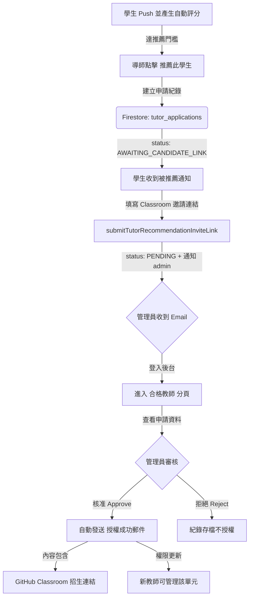

# Tutor Management & Authorization Minimum Viable Product (MVP)
**Version**: 2026.05.13.V1
**Objective**: Standardize the process for identifying, recommending, and authorizing qualified tutors to maintain teaching quality and platform integrity.

## 1. Protocol Overview
The Tutor Management MVP governs the lifecycle of a student's transition to a "Qualified Tutor" (合格導師). It relies on a peer-recommendation model followed by administrative oversight.

## 2. Application & Recommendation Lifecycle
| State | Description | Trigger |
| :--- | :--- | :--- |
| `AWAITING_CANDIDATE_LINK` | Candidate was recommended and must submit classroom invite link first. | Tutor clicks "Recommend Student" in assignment workflow. |
| `PENDING` | Ready for admin review. | Candidate submits classroom invite link (or self-application directly submits). |
| `APPROVED` | Applicant is granted tutoring rights for a specific unit. | Admin clicks "Approve" in Tutor Admin tab. |
| `REJECTED` | Application is dismissed. | Admin clicks "Reject" in Tutor Admin tab. |

## 3. Workflow Implementation

### 3.1 Step 1: Recommendation (Tutor Action)
- **Interface**: Located within assignment workflow actions in Dashboard.
- **Function**: `window.submitTutorRecommendation()`.
- **Action**: Creates a document in the `tutor_applications` collection with `source: "tutor_recommendation"`.
- **Gate**: Requires valid `autoGrade.score` and backend threshold check (`score >= 100`) before recommendation is allowed.
- **Notification**:
  - Sends candidate-facing notification via `sendTutorRecommendationCandidateEmail`.

### 3.2 Step 2: Candidate Link Submission (Student Action)
- **Interface**: Candidate opens email deep link to Dashboard and submits GitHub Classroom invite URL.
- **Function**: `submitTutorRecommendationInviteLink`.
- **Action**: Updates `tutor_applications.status` from `awaiting_candidate_link` to `pending`.
- **Notification**: Sends admin notification via `sendAdminNewApplicationEmail`.

### 3.3 Step 3: Administrative Review (Admin Action)
- **Interface**: The **Tutor Admin** tab (`#view-admin`) in the Dashboard.
- **Aggregation**: `getDashboardData` collects all documents in `tutor_applications` where `status === 'pending'`.
- **Decision Logic**:
    - **Approval**: `decideTutorApplication` updates `tutor_applications` status and writes `users.tutorConfigs[unitId].authorized = true`.
    - **Rejection**: `decideTutorApplication` updates `tutor_applications` status to `rejected`.

### 3.4 Step 4: Automated Onboarding (System Action)
- **Notification**: Calls `sendTutorAuthorizationEmail` via `emailService.js`.
- **Payload**: Includes the unit name, the tutor's dashboard link, and the **GitHub Classroom Invitation Link** for the specific unit.
- **Authorization**: The new tutor now has access to the **Assignments** and **Settings** tabs for the authorized unit to manage their future students.

## 4. Technical Integration Points

### Firestore Collections
- `tutor_applications`: Source of truth for all tutor requests and review status.
- `tutor_configs`: Stores unit-level tutor authorizations and GitHub Classroom URLs.
- `users`: Tracks `tutorConfigs`; `tutorApplications` is a legacy-compatible snapshot.

### Cloud Functions
- `getDashboardData`: Aggregates pending applications for the admin view.
- `decideTutorApplication`: The primary endpoint for approving or rejecting applications.
- `recommendTutorForUnit`: Creates recommendation applications and validates auto-grade threshold.
- `submitTutorRecommendationInviteLink`: Candidate submits classroom invite link and triggers admin notification.

## 5. Security & Validation
- **Role Enforcement**: Only users with `role === 'admin'` can see or execute the `handleDecideApplication` logic.
- **Context Locking**: Tutors are authorized on a **per-unit** basis, ensuring they only manage content they are qualified for.
- **Traceability**: All recommendations are linked to the recommending tutor's UID for audit purposes.

## 6. Related Specs
- `docs/email-notifications.md` (notification matrix and runbook)
- `docs/classroom-bridge-sync-workflow.md` (template -> bridge sync SOP)
- `docs/template-org-migration-runbook.md` (source/publish layer policy)

## 7. Invite URL Validation (Updated 2026-05-15)
為避免推薦綁定錯誤到不相干單元，系統在多個入口採用一致的 GitHub Classroom 邀請連結檢查：

- 格式檢查：
  - 僅接受 `https://classroom.github.com/a/<invite-code>`。
  - 會先做 URL normalize（去掉多餘 query/hash、標準化尾斜線）再驗證。
- 單元對應檢查：
  - 在課程單元頁（Assignments/Settings 綁定）提交時，會比對該單元既有授權設定與已知映射，避免把連結綁到錯誤單元。
  - 在購物車填寫時，會依「本次購買課程項目 -> 對應 courseUnits」縮小可接受範圍，再檢查連結是否可對應到該範圍。
- 購物車留白策略：
  - 購物車允許不填推薦連結。
