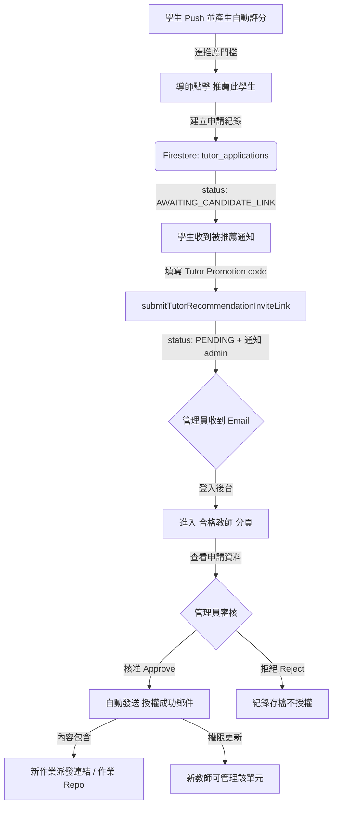

# Tutor Management & Authorization Minimum Viable Product (MVP)
**Version**: 2026.05.13.V1
**Objective**: Standardize the process for identifying, recommending, and authorizing qualified tutors to maintain teaching quality and platform integrity.

## 1. Protocol Overview
The Tutor Management MVP governs the lifecycle of a student's transition to a "Qualified Tutor" (合格導師). It relies on a peer-recommendation model followed by administrative oversight.

## 2. Application & Recommendation Lifecycle
| State | Description | Trigger |
| :--- | :--- | :--- |
| `AWAITING_CANDIDATE_LINK` | Candidate was recommended and must confirm tutor binding / promo code first. | Tutor clicks "Recommend Student" in assignment workflow. |
| `PENDING` | Ready for admin review. | Candidate submits promo code confirmation (or self-application directly submits). |
| `APPROVED` | Applicant is granted tutoring rights for a specific unit. | Admin clicks "Approve" in Tutor Management tab. |
| `REJECTED` | Application is dismissed. | Admin clicks "Reject" in Tutor Management tab. |

## 3. Workflow Implementation

### 3.1 Step 1: Recommendation (Tutor Action)
- **Interface**: Located within assignment workflow actions in Dashboard.
- **Function**: `window.submitTutorRecommendation()`.
- **Action**: Creates a document in the `tutor_applications` collection with `source: "tutor_recommendation"`.
- **Gate**: Requires valid `autoGrade.score` and backend threshold check (`score >= 100`) before recommendation is allowed.
- **Notification**:
  - Sends candidate-facing notification via `sendTutorRecommendationCandidateEmail`.

### 3.2 Step 2: Candidate Link Submission (Student Action)
- **Interface**: Candidate opens email deep link to Dashboard and submits Tutor Promotion code / binding confirmation.
- **Function**: `submitTutorRecommendationInviteLink`.
- **Action**: Updates `tutor_applications.status` from `awaiting_candidate_link` to `pending`.
- **Notification**: Sends admin notification via `sendAdminNewApplicationEmail`.

### 3.3 Step 3: Administrative Review (Admin Action)
- **Interface**: The **Tutor Management** tab (`#view-tutors`, route `tab=tutors`) in the Dashboard.
- **Aggregation**: `getDashboardData` collects all documents in `tutor_applications` where `status === 'pending'`.
- **Decision Logic**:
    - **Approval**: `decideTutorApplication` updates `tutor_applications` status and writes `users.tutorConfigs[unitId].authorized = true`.
    - **Rejection**: `decideTutorApplication` updates `tutor_applications` status to `rejected`.

### 3.4 Step 4: Automated Onboarding (System Action)
- **Notification**: Calls `sendTutorAuthorizationEmail` via `emailService.js`.
- **Payload**: Includes the unit name, the tutor's dashboard link, and the **new assignment / repo link** for the specific unit.
- **Authorization**: The new tutor now has access to the **Assignments** and **Settings** tabs for the authorized unit to manage their future students.

## 4. Technical Integration Points

### Firestore Collections
- `tutor_applications`: Source of truth for all tutor requests and review status.
- `users.tutorConfigs`: Stores unit-level tutor authorizations and assignment / repo settings（歷史 Classroom URL 僅作相容欄位）。
- `users`: Also keeps `tutorApplications` as a legacy-compatible snapshot.

### Cloud Functions
- `getDashboardData`: Aggregates pending applications for the admin view.
- `decideTutorApplication`: The primary endpoint for approving or rejecting applications.
- `recommendTutorForUnit`: Creates recommendation applications and validates auto-grade threshold.
- `submitTutorRecommendationInviteLink`: Candidate submits promo-code binding confirmation and triggers admin notification（歷史函式名保留）。

## 5. Security & Validation
- **Role Enforcement**: Only users with `role === 'admin'` can see or execute the `handleDecideApplication` logic.
- **Context Locking**: Tutors are authorized on a **per-unit** basis, ensuring they only manage content they are qualified for.
- **Traceability**: All recommendations are linked to the recommending tutor's UID for audit purposes.

## 6. Related Specs
- `docs/email-notifications.md` (notification matrix and runbook)
- `docs/classroom-bridge-sync-workflow.md` (template -> bridge sync SOP，歷史備查)
- `docs/template-org-migration-runbook.md` (source/publish layer policy，歷史備查)
- `docs/admin-invite-binding-tool.md` (admin binding lookup，歷史備查)

## 7. Tutor Binding via Promotion Code (Updated 2026-05-20)
- 綁定入口為作業頁（Assignment modal），由學生確認或輸入 Tutor 的 `Promotion code`。
- 購物車流程不再輸入推薦連結或 Promotion code。
- **點擊觸發機制**：學生點擊作業卡下方的「前往教室寫作業」按鈕後，會先彈出確認/綁定視窗（`assignment-link-modal`），以便隨時進行導師確認或異動。
- **自動帶入代碼**：彈出視窗時，系統會自動透過 API 帶入該學生此單元目前已綁定的 `Promotion code`；如果尚未綁定，則欄位為空。
- **留白與異動機制**：如果要異動，請輸入新導師的 Promotion code。若欄位留白並送出，系統會自動為學生指派預設導師 `rover.k.chen@gmail.com`。
- **合格導師驗證**：若有輸入代碼，系統在儲存前會先驗證該 code 是否對應此單元的合格授權導師：
  - 依 `users.promotionCode` 找到 Tutor
  - 檢查 Tutor 在該單元 `tutorConfigs[unitId].authorized === true`
  - 檢查該單元已配置 `assignmentUrl` / `assignmentRepoUrl`（歷史 Classroom URL 僅作相容）
  - 驗證通過後，寫入 `users.unitAssignments` 與 `users.unitAssignmentMeta`，並直接開啟對應作業 Repo；若未通過，則提示錯誤阻擋進入。
  - 舊版 `正式提交作業 (Submit for Review)` 視窗保留為手動 fallback，不再是一般學生的預設路徑。
