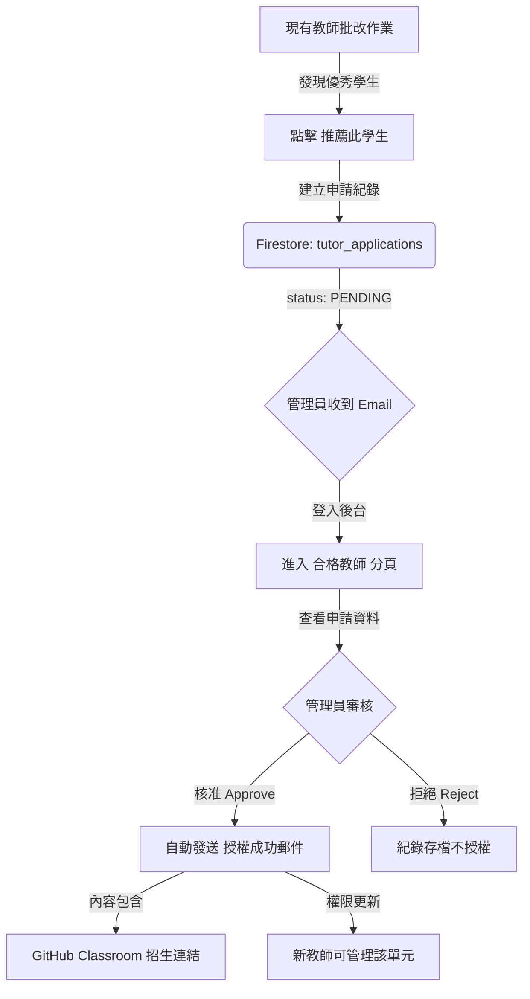

# Tutor Management & Authorization Minimum Viable Product (MVP)
**Version**: 2026.05.13.V1
**Objective**: Standardize the process for identifying, recommending, and authorizing qualified tutors to maintain teaching quality and platform integrity.

## 1. Protocol Overview
The Tutor Management MVP governs the lifecycle of a student's transition to a "Qualified Tutor" (合格導師). It relies on a peer-recommendation model followed by administrative oversight.

## 2. Application & Recommendation Lifecycle
| State | Description | Trigger |
| :--- | :--- | :--- |
| `PENDING` | Initial state after a recommendation or application is submitted. | Tutor clicks "Recommend Student" in Grading Modal. |
| `APPROVED` | Applicant is granted tutoring rights for a specific unit. | Admin clicks "Approve" in Admin Console. |
| `REJECTED` | Application is dismissed. | Admin clicks "Reject" in Admin Console. |

## 3. Workflow Implementation

### 3.1 Step 1: Recommendation (Tutor Action)
- **Interface**: Located within the Assignment Grading Modal (`#grading-modal`).
- **Function**: `window.submitTutorRecommendation()`.
- **Action**: Creates a document in the `tutor_applications` collection with `source: "tutor_recommendation"`.

### 3.2 Step 2: Administrative Review (Admin Action)
- **Interface**: The **Admin Console** tab (`#view-admin`) in the Dashboard.
- **Aggregation**: `getDashboardData` collects all applications where `status === 'pending'`.
- **Decision Logic**:
    - **Approval**: Calls `authorizeTutorForCourse` with `action: 'add'`. This updates the unit's authorized tutors list and sets the applicant's role (if necessary).
    - **Rejection**: Updates the application status to `rejected` and stops the process.

### 3.3 Step 3: Automated Onboarding (System Action)
- **Notification**: Calls `sendTutorAuthorizationEmail` via `emailService.js`.
- **Payload**: Includes the unit name, the tutor's dashboard link, and the **GitHub Classroom Invitation Link** for the specific unit.
- **Authorization**: The new tutor now has access to the **Assignments** and **Settings** tabs for the authorized unit to manage their future students.

## 4. Technical Integration Points

### Firestore Collections
- `tutor_applications`: Stores the history and status of all tutor requests.
- `tutor_configs`: Stores unit-level tutor authorizations and GitHub Classroom URLs.
- `users`: Tracks the `role` and `myTutorConfigs` for individual accounts.

### Cloud Functions
- `getDashboardData`: Aggregates pending applications for the admin view.
- `handleDecideApplication`: The primary endpoint for approving or rejecting applications.
- `authorizeTutorForCourse`: Handles the atomic updates to permissions and configuration files.

## 5. Security & Validation
- **Role Enforcement**: Only users with `role === 'admin'` can see or execute the `handleDecideApplication` logic.
- **Context Locking**: Tutors are authorized on a **per-unit** basis, ensuring they only manage content they are qualified for.
- **Traceability**: All recommendations are linked to the recommending tutor's UID for audit purposes.
