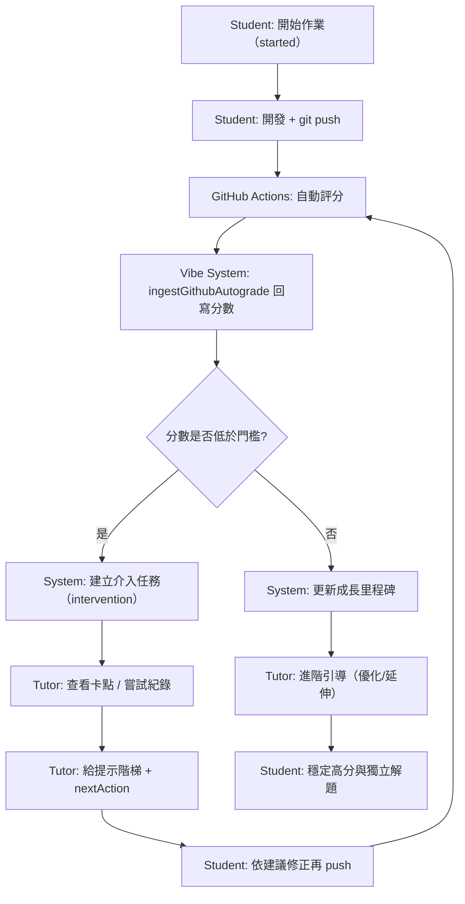

# Tutor x Student 互動層 MVP 規格

本文檔定義在「GitHub 自動評分已上線」前提下，平台如何強化 Tutor 與 Student 的教學互動價值。  
目標是讓分數由系統自動處理，而人與人互動聚焦在「理解題目、拆解問題、修正策略、養成解題能力」。

---

## 1. 產品目標

1. 分數自動化：Push + Autograde 直接回寫，不依賴人工評分。
2. 教學可視化：把「卡住在哪裡」結構化，而不只看最終分數。
3. 導師價值可衡量：能追蹤 Tutor 如何幫學生從低分走到高分。

---

## 2. 核心互動元素（MVP）

1. 任務解讀卡（Assignment Brief）
- 每題提供：題目翻譯、完成定義（Definition of Done）、常見誤解。
- 目的：降低「看不懂題目」造成的早期放棄。

2. 卡點標記（Blockers）
- 學生可在作業中標記卡點類型：`concept` / `debug` / `environment`。
- 目的：Tutor 優先處理真正阻塞，而不是重複講解背景知識。

3. 提示階梯（Hint Ladder）
- Tutor 回覆分三層：
  - L1 方向提示
  - L2 半步驟引導
  - L3 完整拆解
- 目的：避免直接給答案，保留學生自主解題空間。

4. Debug 回放（Attempt Log）
- 學生提交嘗試紀錄：做了什麼、遇到什麼錯、怎麼改。
- 目的：Tutor 能依據過程給建議，不只結果導向。

5. 教學回饋模板（Tutor Coaching Note）
- 固定三段：
  - 做對了什麼
  - 卡在哪裡
  - 下一步只做哪一件事
- 目的：讓回饋可執行，避免空泛評語。

6. 介入任務（Intervention）
- 自動評分低於門檻（例如 `< 70`）時，自動建立 Tutor 介入任務。
- 目的：把「低分」轉成明確教學行動。

---

## 3. 角色視角（Dashboard）

1. Students 視角
- 顯示：
  - 自動評分結果（既有）
  - 目前卡點
  - 下一步任務（由 Tutor 指定）
  - 成長里程碑（首次通過、連續進步等）

2. Tutors 視角
- 顯示：
  - 指派學生卡點清單（可依類型排序）
  - 介入任務待辦
  - 每位學生的最近三次分數趨勢
  - 已給提示層級與回饋紀錄

3. Admin 視角
- 顯示：
  - 全站介入任務完成率
  - 常見卡點分佈（概念/除錯/環境）
  - Tutor 指導覆蓋率（有無被回覆）

---

## 4. 資料模型（規劃）

> 下列為 **規劃中欄位**，不代表現行 production 已全數上線。

### 4.1 `assignments`（擴充）

- `learningState`: `new` | `in_progress` | `blocked` | `coaching` | `resolved`
- `latestBlocker`: `{ type, note, createdAt }`
- `hintLevelUsed`: number (`0~3`)
- `attemptSummary`: string
- `nextAction`: string

### 4.2 新集合：`assignment_coaching_logs`

- `assignmentId`
- `studentUid`
- `tutorEmail`
- `hintLevel` (`1|2|3`)
- `blockerType` (`concept|debug|environment`)
- `coachNote`（三段式內容）
- `createdAt`

### 4.3 新集合：`assignment_interventions`

- `assignmentId`
- `studentUid`
- `triggerScore`
- `threshold`
- `status` (`open|in_progress|resolved`)
- `ownerTutorEmail`
- `createdAt`
- `resolvedAt`

---

## 5. 事件流程（MVP）

1. Student Push -> GitHub Actions Autograde -> `ingestGithubAutograde` 寫回 `autoGrade`
2. 若分數低於門檻 -> 建立 `assignment_interventions` 任務
3. Tutor 在 Dashboard 查看卡點與任務 -> 回覆 `coachNote` / 指定 `nextAction`
4. Student 依 `nextAction` 修正再 Push -> 分數與成長軌跡更新

---

## 6. 互動流程圖（Tutor x Student）

---

## 7. 成功指標（KPI）

1. 首次低分後 7 天內提升分數比例
2. 介入任務平均完成時間
3. 卡點到解決的轉換率（blocked -> resolved）
4. 學生連續進步里程碑達成率

---

## 8. 文件同步規範

若調整以下任一項，需同步更新本文件與 `docs/database.md`：

1. 卡點類型定義
2. 提示階梯層級規則
3. 介入任務觸發門檻
4. 教學回饋模板欄位
