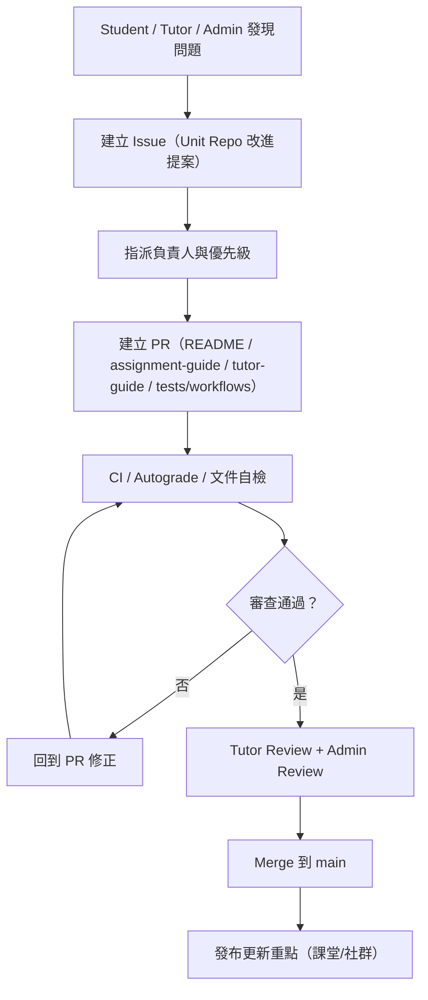
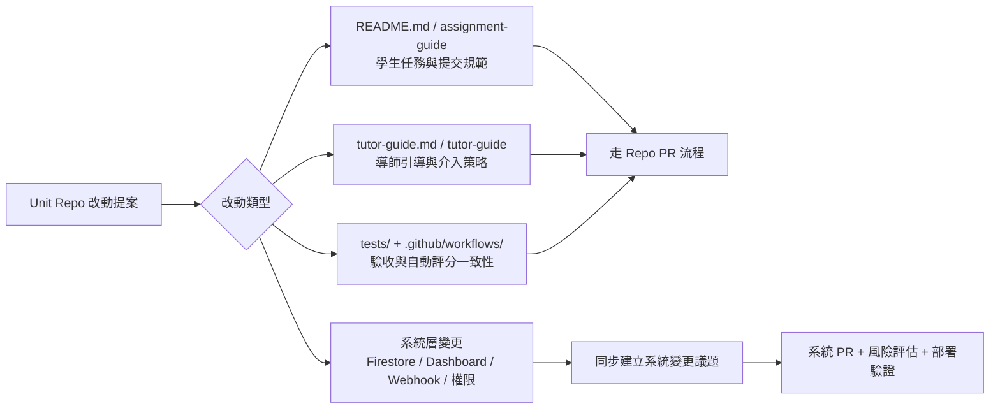

# 單元 Repo 協作改善流程

## 目標
讓每個課程單元以「整個 repository」為協作對象，持續改善教學與評分品質。  
協作範圍包含：
- `README.md`（學生任務與提交規範）
- `tutor-guide.md`（導師引導與介入策略）
- `test/`、`.github/workflows/`、範例程式與附件模板（驗收與教學支援）

系統對應：
- `Dashboard > Assignments`：直接讀取課程頁隱藏區塊 `<section id="assignment-guide">`
- `Dashboard > Settings`：直接讀取課程頁隱藏區塊 `<section id="tutor-guide">`

## 角色
- `Student (user)`: 提出閱讀卡點、提交需求不清、驗收標準模糊等問題。
- `Tutor`: 提供教學可用性建議，確保指引可執行。
- `Admin`: 維護規範一致性，審核與合併。

## 建議工作流
1. 開 Issue（使用 `README 改進提案` 模板）
2. 在對應課程 repository 建立 PR（可同時修改 README、tutor guide、`assignment-guide` / `tutor-guide` 區塊、測試/範例）
3. 依 PR template 完成一致性檢查
4. 至少 1 位 Tutor + 1 位 Admin Review 後 merge
5. merge 後在課堂公告或群組同步「本次單元 repo 改動重點」

延伸：若本次改動需要回補到既有學生作業 repo，請使用 [舊版學生 Repo 同步 PR 流程](/Users/roverchen/Documents/Apps/vibe-coding-tw/docs/classroom-sync-pr-workflow.md)（歷史備查）。

### 流程圖：提案到合併

## 內容改版原則
- 聚焦可執行：學生看完 README 應知道「現在要做什麼」。
- 教學可介入：導師看完 tutor guide 應知道「何時、如何介入」。
- 驗收可重現：測試與 workflow 能穩定驗證同一標準。
- 明確提交物：列出必交檔案、命名規則、關鍵驗收字串。
- 明確評分標準：自動評分條件、通過門檻、常見失敗原因。
- 降低歧義：避免模糊詞，時間、檔案、步驟盡量具體。
- 小步改版：一次只改一個主題，降低審查與回滾成本。

## 推薦節奏
- 每週固定 1 次單元 repo 維護時段（30-60 分鐘）
- 每次最多處理 3-5 個高影響提案
- 優先順序：
  1. 影響提交正確性的問題
  2. 影響自動評分通過率的問題
  3. 影響新手理解成本的問題

## 完成定義 (Definition of Done)
- README / assignment-guide / tutor-guide / 測試或 workflow 的必要更新已合併到 `main`
- PR checklist 全部勾選完成
- 至少一位 Tutor 驗證「新手可依 assignment-guide 完成提交，導師可依 tutor-guide 有效介入」
- 公告已同步（課堂或社群）

## 變更治理
若改動涉及下列高風險範圍，需同步開系統變更議題，不只停留在 repo 文檔修改：
- Firestore 欄位/結構
- Dashboard 作業流程
- Autograde payload 與 webhook 規格
- 權限模型（admin/user、tutor status）

### 流程圖：內容治理邊界

